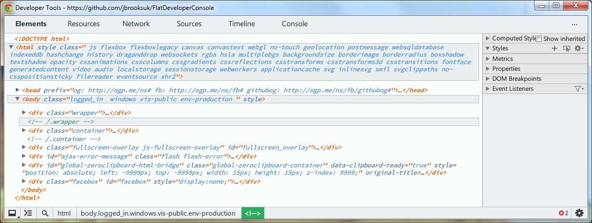

# Flat Developer Console
Basic FlatUI inspired Google Chrome Developer Console stylesheet.

# Installation
You'll need to open the directory Chrome uses to store User Stylesheets in.

- Windows: `C:\Users\username\AppData\Local\Google\Chrome\User Data\Default\User Stylesheets\`
- Linux: `~/.config/google-chrome/Default/User StyleSheets/`
- OSX: `~/Library/Application\ Support/Google/Chrome/Default/User\ StyleSheets/`
- Chrome OS: `~/User\ StyleSheets/` (requires [developer mode](https://sites.google.com/site/chromeoswikisite/home/what-s-new-in-dev-and-beta/developer-mode))

1. Open the directory applicable to your OS *(see above)*.
2. Backup `Custom.css`
3. Clone or copy `Custom.css` from this repository.
4. Done! Chrome will automatically reload the stylesheet for you.

# Screenshot

# License
MIT - [http://jbrooksuk.mit-license.org](http://jbrooksuk.mit-license.org)
